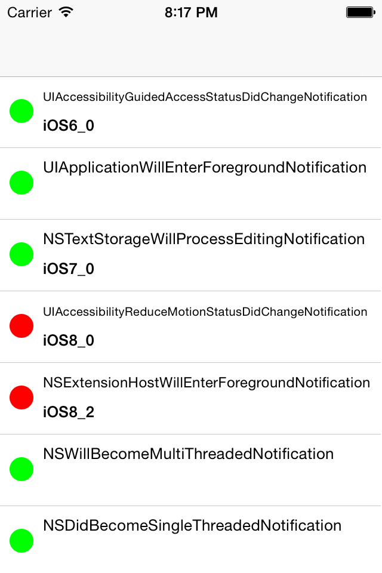
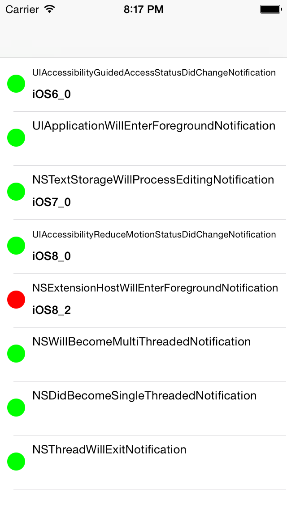

##JMSystemNotifications

JMSystemNotifications is an Objective-C library for easily register OS System notifications. 
Here, the first 114 Notifications :)




###Why ?
- Registering/unregistering using a block API for NSNotification is very boring,
- NSNotificationName can be OS version dependant (iOS version in check, no crash), 
- Do you know those available notifications?

# Usage
```
   pod JMSystemNotification
```

```objc
  #import "NSObject+JMSystemNotification.h"
```
###Registering System Notifications 

```objc

- (BOOL)jm_observeNotification:(JMSystemNotification)notification usingBlock:(JMNotificationBlock)block;
- (BOOL)jm_observeNotification:(JMSystemNotification)notification usingBlock:(JMNotificationBlock)block error:(NSError **)error;
```

With error catching, because some notifications are iOS version dependant
```objc
BOOL addObserverSucessfully = [self jm_observeNotification:JMUserDefaultsDidChangeNotification usingBlock:^(NSNotification *notif) {
	NSLog(@"JMUserDefaultsDidChangeNotification");
}];
	
NSError *error;
[self jm_observeNotification:JMUserDefaultsDidChangeNotification usingBlock:^(NSNotification *notif) {
	NSLog(@"JMUserDefaultsDidChangeNotification");
} error:&error];
```

###Unregistering System Notifications 

```objc
- (void)jm_removeObservedNotification:(JMSystemNotification)notification;
- (void)jm_removeObservedNotifications;
```

### Current observed notifications 
```
NSTextStorageWillProcessEditingNotification;
NSTextStorageDidProcessEditingNotification;
UIWindowDidBecomeVisibleNotification;
UIWindowDidBecomeHiddenNotification;
UIWindowDidBecomeKeyNotification;
UIWindowDidResignKeyNotification;
UIKeyboardWillShowNotification;
UIKeyboardDidShowNotification;
UIKeyboardWillHideNotification;
UIKeyboardDidHideNotification;
UIKeyboardWillChangeFrameNotification;
UIKeyboardDidChangeFrameNotification;
UITextFieldTextDidBeginEditingNotification;
UITextFieldTextDidEndEditingNotification;
UITextFieldTextDidChangeNotification;
UIAccessibilityPostNotification;
UIAccessibilityMonoAudioStatusDidChangeNotification);
UIAccessibilityClosedCaptioningStatusDidChangeNotification);
UIAccessibilityInvertColorsStatusDidChangeNotification);
UIAccessibilityGuidedAccessStatusDidChangeNotification);
UIAccessibilityBoldTextStatusDidChangeNotification);
UIAccessibilityGrayscaleStatusDidChangeNotification);
UIAccessibilityReduceTransparencyStatusDidChangeNotification);
UIAccessibilityReduceMotionStatusDidChangeNotification);
UIAccessibilityDarkerSystemColorsStatusDidChangeNotification);
UIAccessibilitySwitchControlStatusDidChangeNotification);
UIAccessibilitySpeakSelectionStatusDidChangeNotification); 
UIAccessibilitySpeakScreenStatusDidChangeNotification);
UIAccessibilityScreenChangedNotification;
UIAccessibilityLayoutChangedNotification;
UIAccessibilityAnnouncementNotification;
UIAccessibilityAnnouncementDidFinishNotification;
UIAccessibilityPageScrolledNotification;
UIAccessibilityPauseAssistiveTechnologyNotification;
UIAccessibilityResumeAssistiveTechnologyNotification;
UIAccessibilityNotificationSwitchControlIdentifier);
UIApplicationDidEnterBackgroundNotification;
UIApplicationWillEnterForegroundNotification;
UIApplicationDidFinishLaunchingNotification;
UIApplicationDidBecomeActiveNotification;
UIApplicationWillResignActiveNotification;
UIApplicationDidReceiveMemoryWarningNotification;
UIApplicationWillTerminateNotification;
UIApplicationSignificantTimeChangeNotification;
UIApplicationWillChangeStatusBarOrientationNotification;
UIApplicationDidChangeStatusBarOrientationNotification;
UIApplicationWillChangeStatusBarFrameNotification;
UIApplicationDidChangeStatusBarFrameNotification;
UIApplicationBackgroundRefreshStatusDidChangeNotification;
UIApplicationUserDidTakeScreenshotNotification);
UIContentSizeCategoryDidChangeNotification;
UIDeviceOrientationDidChangeNotification;
UIDeviceBatteryStateDidChangeNotification;
UIDeviceBatteryLevelDidChangeNotification; 
UIDeviceProximityStateDidChangeNotification; 
UIDocumentStateChangedNotification;
UIMenuControllerWillShowMenuNotification;
UIMenuControllerDidShowMenuNotification;
UIMenuControllerWillHideMenuNotification;
UIMenuControllerDidHideMenuNotification;
UIMenuControllerMenuFrameDidChangeNotification;
UIPasteboardChangedNotification;
UIPasteboardRemovedNotification;
UIScreenDidConnectNotification;
UIScreenDidDisconnectNotification; 
UIScreenModeDidChangeNotification; 
UIScreenBrightnessDidChangeNotification; 
UITableViewSelectionDidChangeNotification;
UITextInputCurrentInputModeDidChangeNotification;
UITextViewTextDidBeginEditingNotification;
UITextViewTextDidChangeNotification;
UITextViewTextDidEndEditingNotification;
UIViewControllerShowDetailTargetDidChangeNotification;
NSManagedObjectContextWillSaveNotification;
NSManagedObjectContextDidSaveNotification;
NSManagedObjectContextObjectsDidChangeNotification;
NSPersistentStoreDidImportUbiquitousContentChangesNotification;
NSPersistentStoreCoordinatorStoresWillChangeNotification;
NSPersistentStoreCoordinatorStoresDidChangeNotification;
NSBundleDidLoadNotification;
NSCalendarDayChangedNotification;
NSSystemClockDidChangeNotification;
NSExtensionHostWillEnterForegroundNotification;
NSExtensionHostDidEnterBackgroundNotification;
NSExtensionHostWillResignActiveNotification;
NSExtensionHostDidBecomeActiveNotification;
NSFileHandleReadCompletionNotification;
NSFileHandleReadToEndOfFileCompletionNotification;
NSFileHandleConnectionAcceptedNotification;
NSFileHandleDataAvailableNotification;
NSFileHandleNotificationDataItem;
NSFileHandleNotificationFileHandleItem;
NSFileHandleNotificationMonitorModes;
NSUbiquityIdentityDidChangeNotification;
NSHTTPCookieManagerAcceptPolicyChangedNotification;
NSHTTPCookieManagerCookiesChangedNotification;
NSCurrentLocaleDidChangeNotification;
NSMetadataQueryDidStartGatheringNotification;
NSMetadataQueryGatheringProgressNotification;
NSMetadataQueryDidFinishGatheringNotification;
NSMetadataQueryDidUpdateNotification;
NSPortDidBecomeInvalidNotification;
NSWillBecomeMultiThreadedNotification;
NSDidBecomeSingleThreadedNotification;
NSThreadWillExitNotification;
NSSystemTimeZoneDidChangeNotification;
NSUbiquitousKeyValueStoreDidChangeExternallyNotification;
NSUndoManagerCheckpointNotification;
NSUndoManagerWillUndoChangeNotification;
NSUndoManagerWillRedoChangeNotification;
NSUndoManagerDidUndoChangeNotification;
NSUndoManagerDidRedoChangeNotification;
NSUndoManagerDidOpenUndoGroupNotification;
NSUndoManagerWillCloseUndoGroupNotification;
NSUndoManagerDidCloseUndoGroupNotification
NSURLCredentialStorageChangedNotification;
NSUserDefaultsDidChangeNotification;
ALAssetsLibraryChangedNotification;
ACAccountStoreDidChangeNotification;
PKPassLibraryDidChangeNotification;
EKEventStoreChangedNotification;
MFMessageComposeViewControllerTextMessageAvailabilityDidChangeNotification;
```


### Todo
* AVFoundation
* CloudKit
* ExternalAccessory
* GameKit
* GameController
* HealthKit
* MediaPlayer
* NetworkExtension
* NewsstandKit
* CoreBluetooth?
* CoreMedia?
* CoreFoundation?
